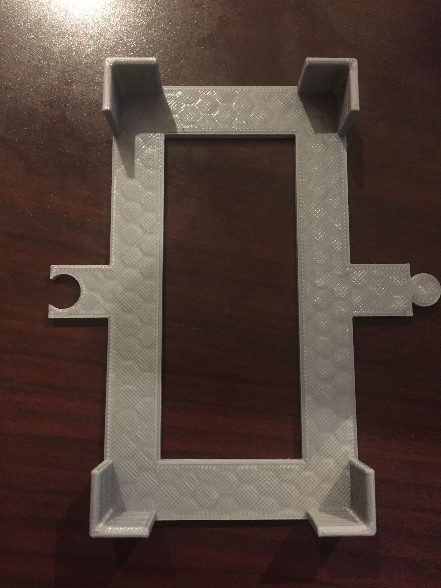
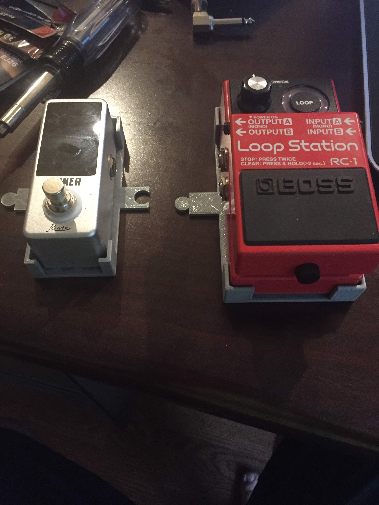
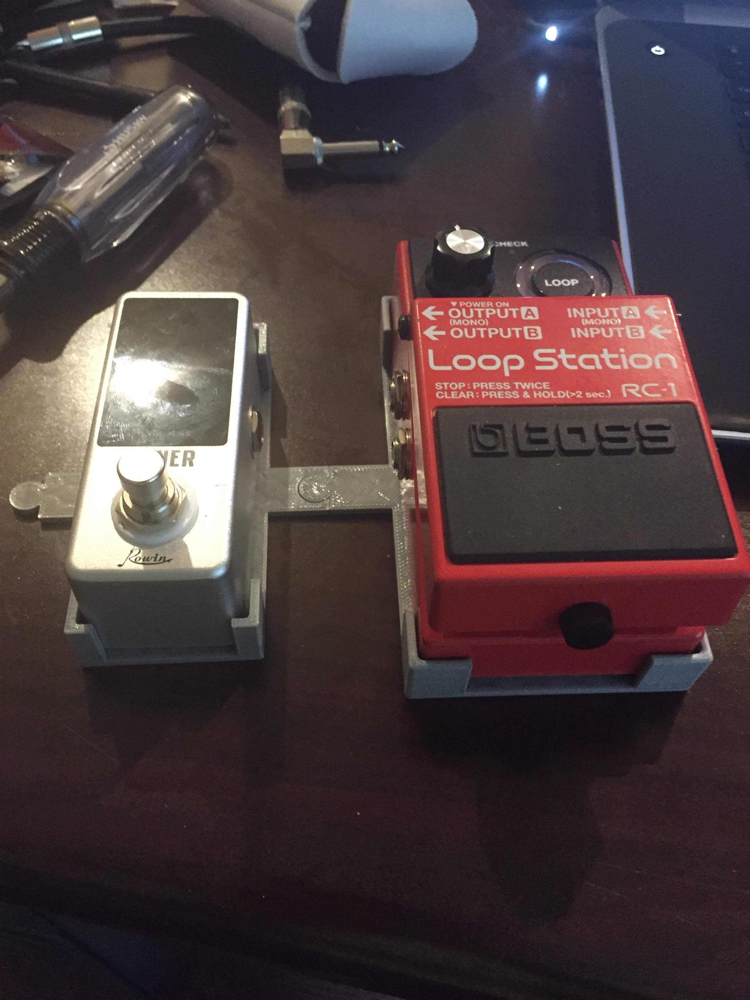
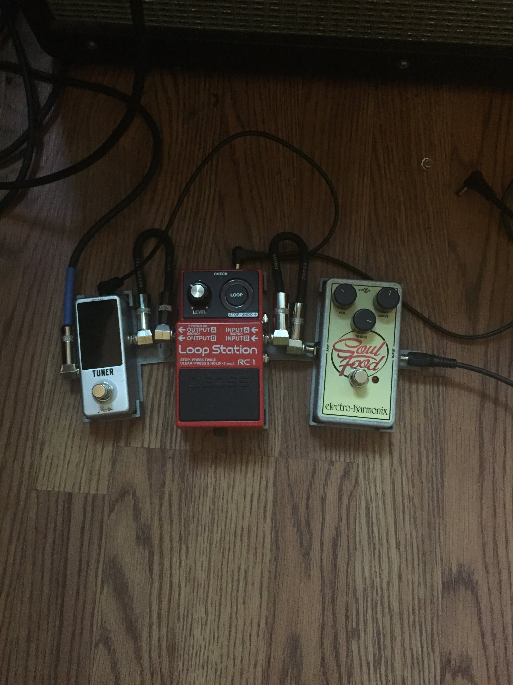
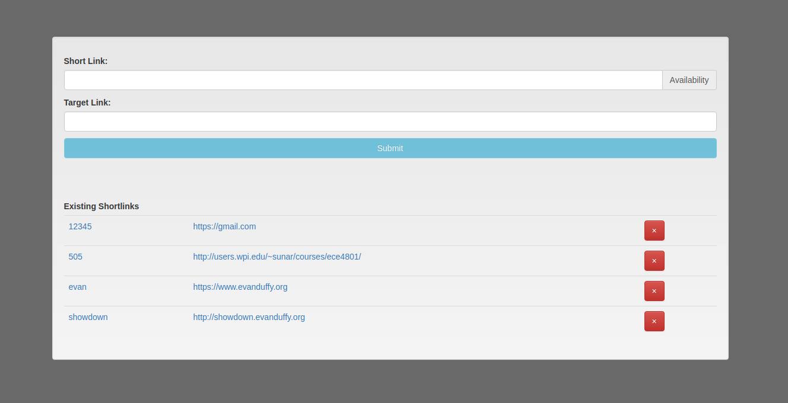

# Projects

## Modular Guitar Pedal Mounts:

When I'm not programming or 3D printing, my favorite thing to do it to play guitar. Sometimes when I have my guitar effects pedals set up for long periods of time they will shift around and get their cables tangled up. To combat this I created a few different mounts for these pedals, one for each brand, that can interlock and keep them neat and tidy. No more tangled cables!

[Here](PedalMounts.zip) are the STL and SLDPRT files if anyone is interested!

---

## [Redirect](https://redirect.evanduffy.org/create.html):

Redirect is a [bit.ly](https://bit.ly) clone that I wrote for my own convenience. It allows me to create short links and then reference them from a shorter link. For instance going to `redirect.evanduffy.org/?{some shortlink}`, or `r.evanduffy.org/?{some shortlink}` for convenience, will send you to the long link associated with that short link. Shortlinks can be added or removed at the `create.html` page.

---

More To Come!
